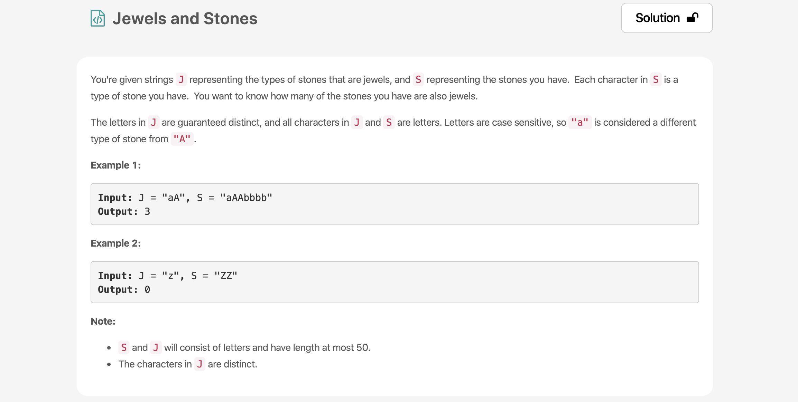
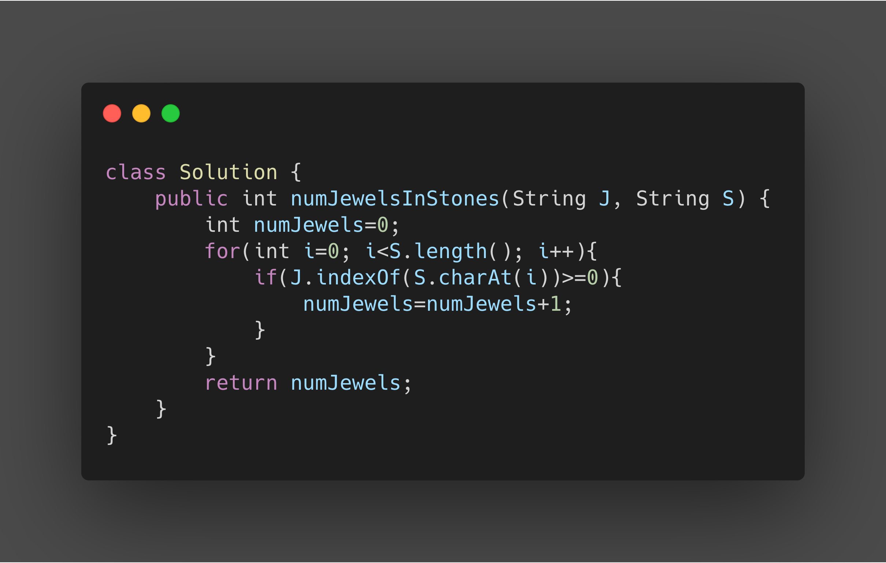

* The indexOf method and charAt method of String is the highlight here.
* indexOf method returns the index of the String where the char is situated.
* charAt method returns the char at particular index in a String.