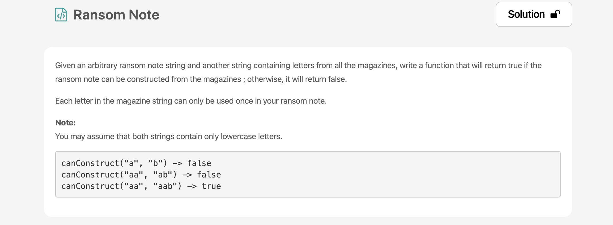
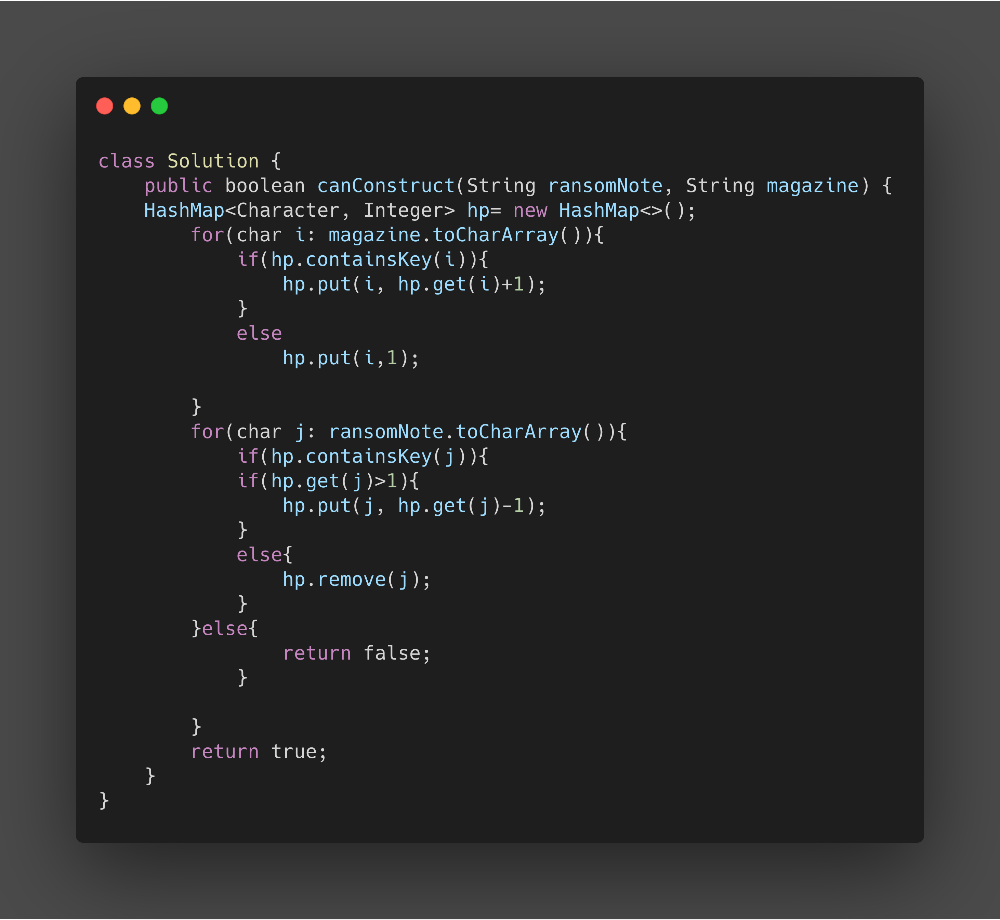

* This Problem Introduced HashMap DS
* string.toCharArray() converts the String to Array
* hp.containsKey(i) return true/false if it Contains Key i.
* hp.get(i) get the Value of Key i from HashMap
* hp.put(i, i) puts the Value of Key i as 1
* hp.remove(j) removes entry for Key j 