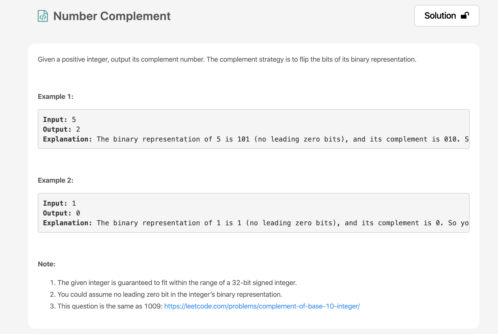
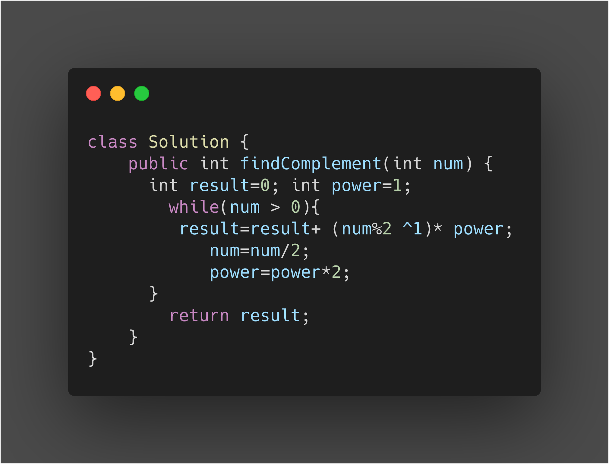

* This is Basically Taking the 1s Complement of any Number.
* While our number is greater than zero,
* We obtain the Remainder by dividng by 2 and then XoR it with 1 which reverses it Bits and then we multiply it with its power.
* We divide the Number by 2, take the quotient and store it as the new number that is to be processed.
* We multiply the power by 2 since binary digits increase by the power of 2.