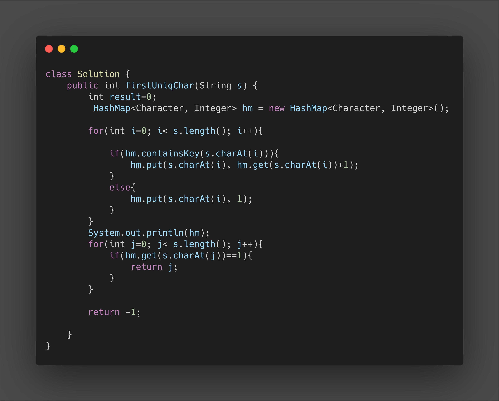

* Taking each character in String and putting it in a Hashmap
* If the character exist we will just increment it value by 1
* If the character doesnt exist, we will create a new entry for it.
* In the end we will just check for the first character with occurance value 1.