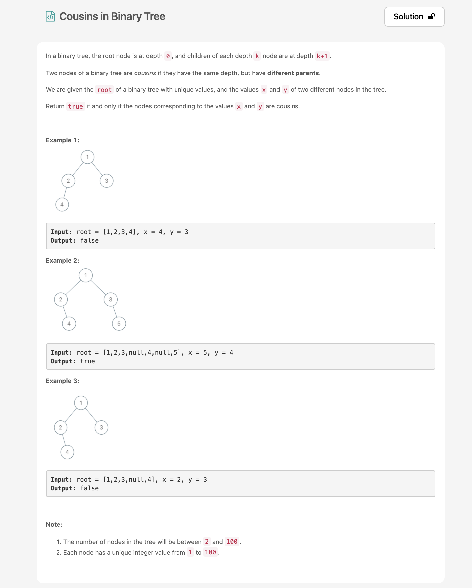
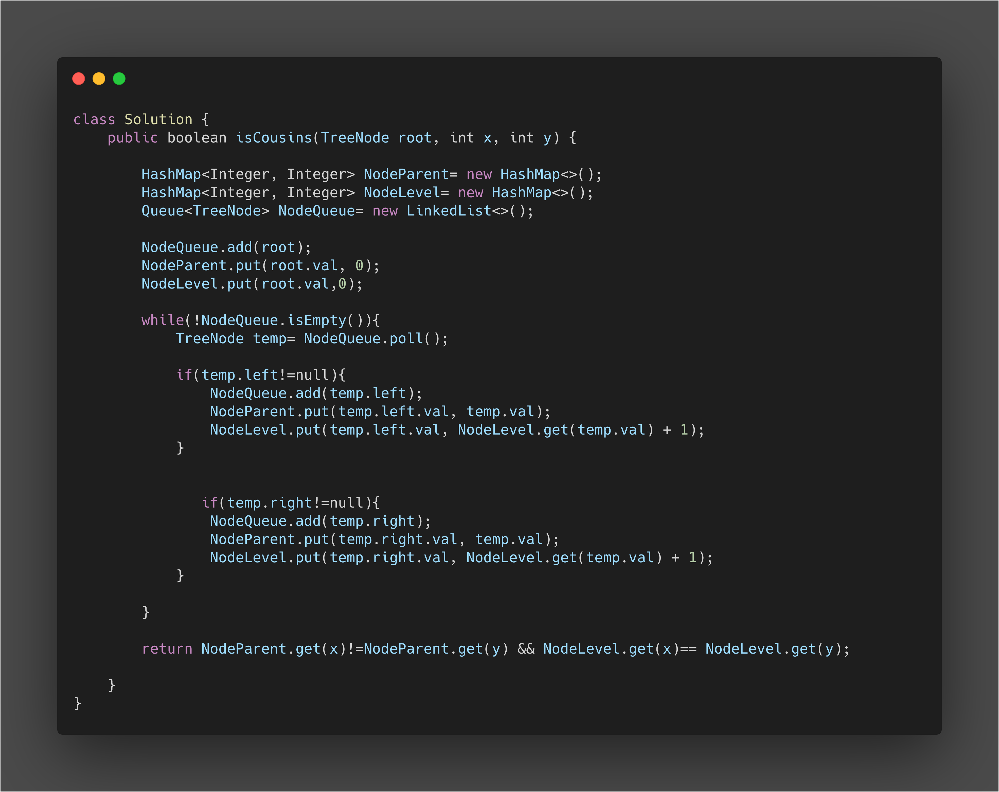

* In this Problem we used Three DataStructures, HashMap, Queue(LinkedList) and Binary Tree.
* We have used NodeParent HashMap to store Node and Its Parent
* We have used NodeLevel HashMap to store Node and Its Level
* We constantly add Nodes to Queue as and When we encounter them, left first and then right.
* The queue is polled Everytime in order to get the new Node and extract its left and right child nodes.
